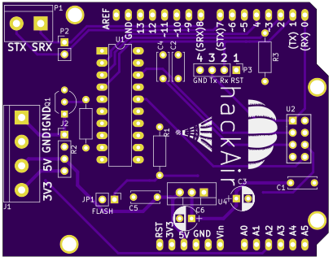

hackAIR is an EU-funded project aiming to develop an open technology platform for citizen observatories on air quality. Air pollution is an environmental issue with serious health and lifespan implications. However, it remains difficult for citizens to assess their exposure to air pollution and air quality issues in their country. Official air quality sensors are often few and far between, coverage is poor outside cities, and their data is not always easily accessible.

## hackAIR WiFi shield

The hackAIR WiFi shield is a do-it-yourself solution for adding wireless connectivity to an Arduino node on the cheap. It's based around a custom PCB and the ESP8266 WiFi module and it's supported by the hackAIR firmware. All the network-related work is done by the WiFi module that can be controlled by simple serial commands. The [hackAIR library for Arduino](https://github.com/hackair-project/hackAir-Arduino) contains helpful wrapper functions to make using the shield easy and simple.

### Where to order

PCBs can be ordered directly from OSHPark [here](https://oshpark.com/shared_projects/u7Z6d8GR). The source files are included in this repository so anyone can order from their manufacturer of choice. Work is being done  to make complete kits available soon.

### Documentation

Documentation for this shield is under construction [here](https://hackair-project.github.io/hackAir-Arduino/wifi/).

### Technicalities

The PCB is designed using the open source EDA called [KiCad](http://kicad-pcb.org/). The PCB render shown above is created using [PcbDraw](https://github.com/yaqwsx/PcbDraw).

### Changelog

#### Version 2
 - [Add] Pull-down resistor for pin 2 (ESP Reset) so the user can flash the Arduino without jumpers
 - [Add] Silkscreen markings for pin numbers
 - [Add] Programming header for the WiFi module
 - [Del] Removed sensor I/O header used by analog sensors
 - [Del] Removed the RC filter required by some analog sensors by SHARP
 - [Fix] Move some decoupling capacitors closer to the power pads
 - [Fix] Moved the CONN_POWER and CONN_SERIAL connectors away from the USB connector of the Arduino board
 - [Fix] Fixed some acid traps in the routing
 - [Fix] Fixed the footprint of Q1 (DSG -> DGS)
 - [Fix] Changed the foorprints of all non-electrolytic caps to be wider.
 - [Fix] Fixed the silkscreen of U1 appearing on the wrong layer.

#### Version 1
Initial release
